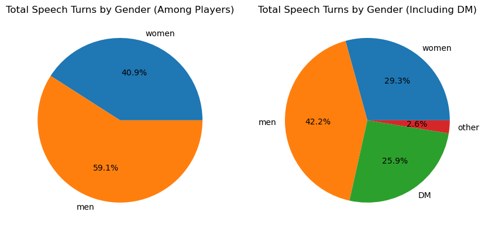
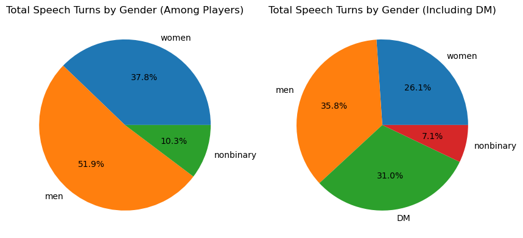
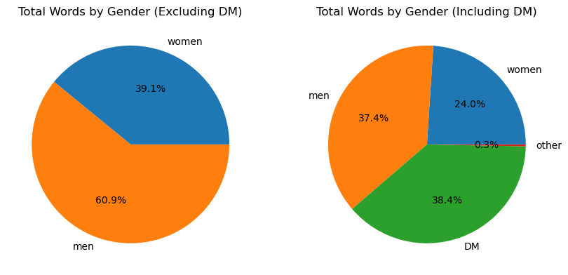
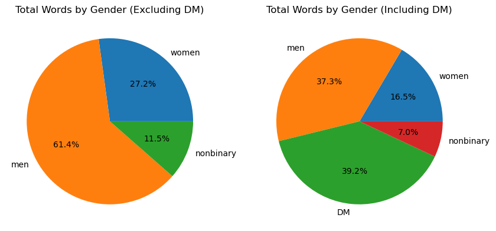
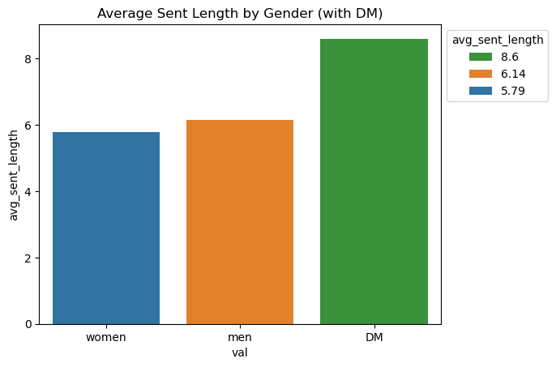
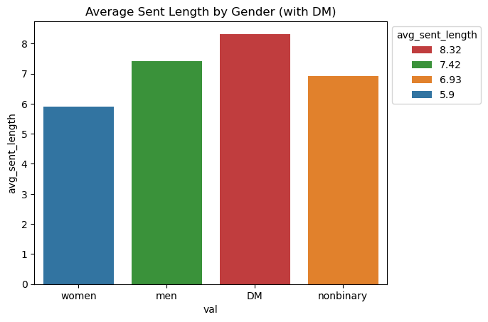

Ashley Bakaitus
April 29, 2025

# Final Report

## History

It took me some time to find inspiration for a project subject. I initially wanted to avoid any kind of copywritten data to be safe, but once I reviewed past projects and saw what people studied, it inspired me to look into something I personally really enjoy: D&D!
For the Critical Role data, sourcing it was very easy. They have a super dedicated fanbase, and for several years had a fan-run group who transcribed every episode for the purpose of video subtitles for viewers. 
The site Kryogenix compiled all of those subtitles ripped from the videos themselves as html, and provided a script to tidily convert those files into json files. 

For Dimension 20, the data was less simple. It's hosted on Google Drive and similarly created and edited by dedicated fans of the show. I was able to get in touch with them, and they very kindly invited me to their Drive to access all their files. 
I was able to save the data directly from the drive and convert it similarly to a json file (since by then they were familiar for my purpose). However, the original formatting was preserved, and all the data is center aligned with line breaks to maintain column width. 

Data cleaning was, by far, the part of this project with the most bumps in the road. Those notebooks can be viewed [here](https://nbviewer.org/github/Data-Science-for-Linguists-2025/Critical-Role-Analysis/tree/main/data_processing/).
This was my first time working with json files, and the CR file was very nested. Once I studied up on json normalization, though, getting a base dataframe was just a matter of defining a few functions and testing them out!
For Critical Role, it was the ["nonspeech"](https://nbviewer.org/github/Data-Science-for-Linguists-2025/Critical-Role-Analysis/blob/main/data_processing/2_cr_cleaning.ipynb#Splitting-and-cleaning) column that was the most time consuming.
I had several false starts working at it to separate out and get a clean column containing only speech information. One early attempt included cloning the speech column entirely with the thought of deleting anything in (brackets) from one and deleting anything not in (brackets) from the other. 
This wasn't quite as simple as that in the end, and I ultimately found the method of creating many small Pandas Series much more productive. I frequently ran into my regex scanning and separating capturing the same index rows multiple times, giving me a duplicate index error, but I fixed it by creating more and more narrow Series and tweaking my regex. 
It took a long while on my first go, but the feeling of when my duplicate index check first cleared with no duplicates was beautiful. 

With the Dimension 20 data there was much more cleanup required. The regex routine was less complicated since I'd spent so much time on it before, but the data was more difficult. Everything was included in the same column as the speech, and nonspeech information like sound effects was not marked with brackets. 
While this took more time, there were just a few more steps to undertake, seen [here](https://nbviewer.org/github/Data-Science-for-Linguists-2025/Critical-Role-Analysis/blob/main/data_processing/2_aabria_cleaning.ipynb#Concatenating-and-Splitting).

Even once I had my data in hand I didn't immediately know where to start. Only through starting exploration and having conversation did I stumble into my analysis goals and some of my more interesting ideas like the question of jargon.

## Data Information

I ended up with a total of 201 json files (147 CR and 54 D20) in the shape of two dataframes. Once all dataframes were in their final forms, this put us at 434,050 rows (or speech turns) in the Critical Role data, and 63,602 turns in the D20 data. This includes speech turns that were singularly nonspeech, meaning one turn could just contain (laughter) or something similar.

The Critical Role data is one full campaign, or adventure, played start to finish over a period of roughly four years. The group is made up of one DM and seven consistent players. There are a handful of guests who appear for an episode or two who are combined into an "other" category for tidiness sake in my analysis.
The Dimension 20 data consists of four campaigns of varying lengths, and three seasons of their post-game chat show they do about the episode just played. 

Critical Role has four players who are men, three women, and a man as their DM.
Dimension 20, in these sets, have eight players who are men, eight who are women, two who are nonbinary, and a woman as their DM.

## Motivations & Research Questions

My goal for my project has been to conduct a discourse analysis on these two data sets to look into the balance of DM to player speech between a man DM (Critical Role, Matt) and a woman DM (Dimension 20, Aabria).
A secondary goal, while looking at the data, was to consider the balance at a table between players themselves, without the DM. Are players who are men or women talking more often, saying more words, taking more time? Or is there more of an equal balance?

## Analysis

My individual analysis for the two data sets can both be explored in my [notebooks/](https://nbviewer.org/github/Data-Science-for-Linguists-2025/Critical-Role-Analysis/tree/main/notebooks/) folder in my project hub.
The files cr_analysis.ipynb and d20_analysis.ipynb cover the numbers and my analysis and interpretations per set in some detail, and so this section will be dedicated to the *comparison* of the two.

I did several more steps on the Critical Role data since it's where I started, like word lengths and average sentence length for sentences over a certain length. However since they were not extremely informative I did not repeat them for D20 and won't be further analyzing them.
Similarly, my early intention for this project was to include interruption as one of my metrics of study. I address this at the end of both notebook, but wanted to touch on it here as well. Without a significant time commitment, this aspect was difficult to quantify and was not analyzed. 

### Speech Turns

**Critical Role**

**D20**

### Word Count

**Critical Role**

**D20**

### Sentence Length

**Critical Role**

**D20**

### Hedging

**Critical Role**

**D20**

### Jargon & Readability

**Critical Role**

**D20**

## Conclusions & Reflections

My most 

## Resources

